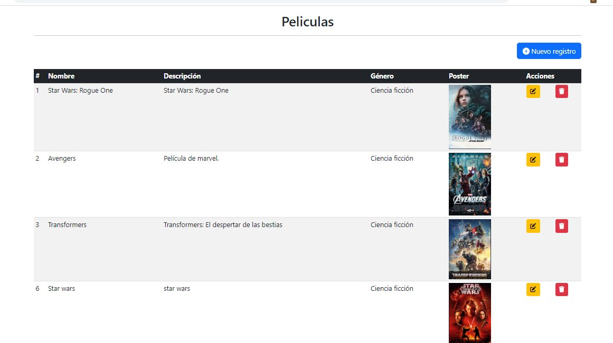
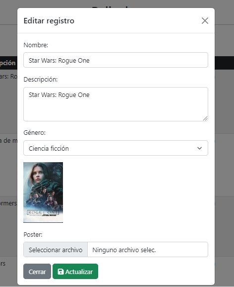
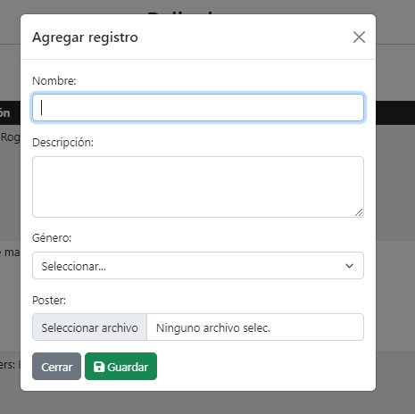
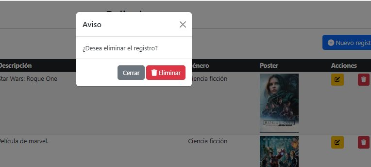

# CRUD con modals, PHP, MYSQL, MYSQLI, BOOTSTRAP

CRUD usando 2 tablas relacionadas pelicula y géneros, dónde también usamos imágenes.

## TECH & TOOLS :wrench:

* Html
* Css
* PHP
* MYSQL
* Bootstrap
* AJAX con fetch
* Conexión mysqli a base de datos
* Uso de modales de bootstrap

## SCREENSHOT

